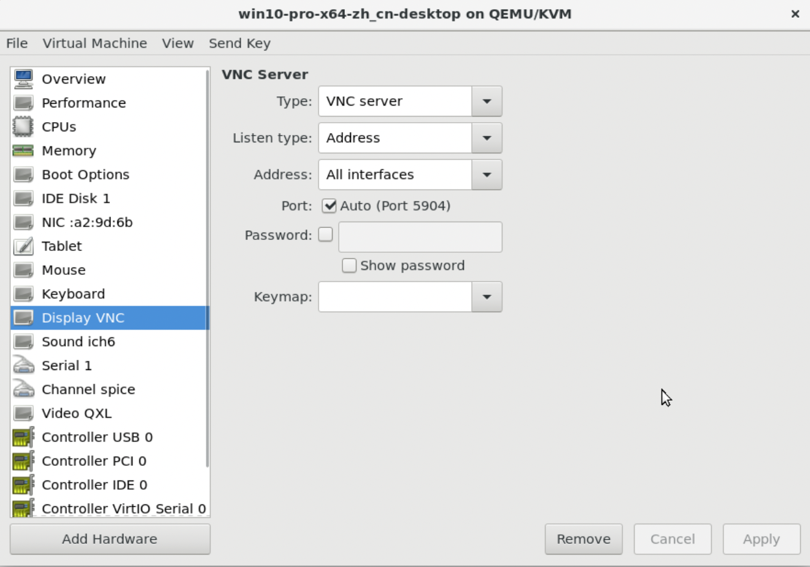

## 部署远程桌面代理

在宿主机上，完成以下步骤。

1. 执行以下命令，克隆代理项目的代码到kvm目录下；

   `git clone https://github.com/novnc/websockify.git` ~/kvm/websockify

2. 在websockify同级目录，新建token文件夹；

3. 在token文件夹中，新建如下格式的配置文件；

   `token_of_vm01: 192.168.1.215:5904`

   - token_of_vm01：用于访问虚拟机的token；

   - 192.168.1.215：宿主机的IP地址；

   - 5901：虚拟机的VNC端口号。

   *注：由于QEMU/KVM虚拟机的VNC服务端口是自增的，在ZAgent启动宿主机代理时，我们使用代码来自动创建10个token文件，完成端口5901-5910到token的映射，并使用一个Map缓存起来。当宿主机代理收到创建虚拟机的请求时，可根据VNC的端口返回其对应的token。具体代码实现可参考[这里](https://github.com/easysoft/zagent/blob/main/internal/agent-host/service/setup.go)。*

4. kvm下使用virt-manager，修改虚拟机远程桌面的类型为VNC Server，地址（Address）为所有接口（All interface），端口为自动（Auto）；

   ; multipass下部署vncserver，见[第二部](multipass/2-vm.md)

5. 执行以下命令，启动websockify服务。6080为代理端口，../token/为端口转发配置文件所在的目录；

   `~/kvm/websockify/run --token-plugin TokenFile --token-source ~/kvm/token/ 6080`

## 部署NoVNC服务

1. 执行以下命令，获取远程桌面项目的代码；

   `git clone https://github.com/novnc/noVNC.git ~/kvm/noVNC`

2. 将项目中的文件拷贝到Web服务器中，或使用以下步骤安装一个静态服务器；

   - 从[这里](https://nodejs.org/zh-cn/download/)下载并安装node.js环境；
   - 执行npm install -g light-server安装服务器；
   - 执行light-server -s ~/kvm/nodVNC 启动noVNC服务，默认端口为4000。

## 访问远程桌面

1. 在工作电脑上，用浏览器打开http://<宿主机IP地址>:4000/vnc.html；

2. 填入以下信息：

   - 主机：宿主机IP地址；

   - 端口：websockify代理的端口号；

   - 路径：websockify?token=token_of_vm01，其中token_of_vm01为上述token配置文件中的第一列。

   

3. 点击网页中的*连接*按钮，打开虚拟机vm01的远程桌面；

4. 另外，您也可使用简化版的vnc_lite.html页面来访问桌面。

   `http://<宿主机IP地址>:4000/vnc_lite.html?host=192.168.1.215&port=6080&path=websockify/?token=token_of_vm01`